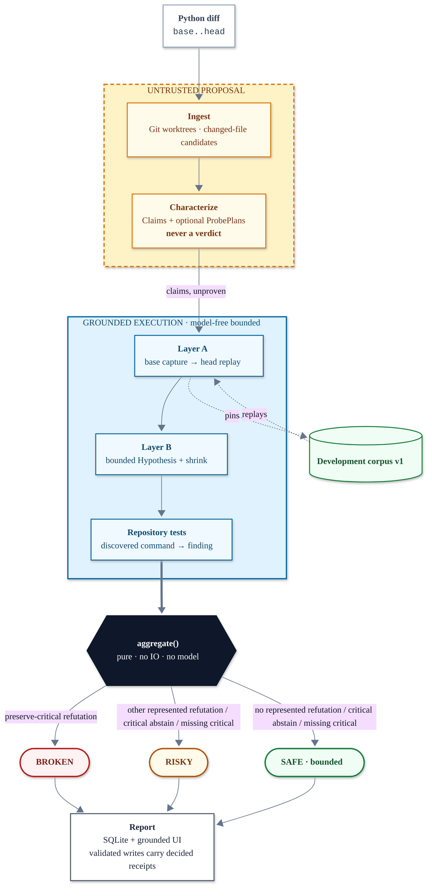

# OpenAI Build Week 2026 — Cross-Examine

> **Codex writes the code. Cross-Examine puts it on the stand.**
>
> Git worktrees → GPT-5.6 Sol claims → trusted-input base/head execution → pure `aggregate()` → FastAPI/React report.

<!-- Demo GIF slot: docs/assets/demo.gif -->

[](https://github.com/stefbuilds/cross-examine/actions/workflows/verify.yml)
[](pyproject.toml)
[](LICENSE)

[](https://cross-examine-six.vercel.app)

Cross-Examine is an independent verification harness for Codex-authored Python changes.
It captures the base revision's behavior, executes the head revision against the same
inputs, and hunts adversarial boundaries. Newly executed reports that pass pipeline
validation show the exact command and captured output for every `VERIFIED` or `REFUTED`
finding. Abstentions show attempted evidence or a deterministic diagnostic instead of
fabricating a receipt. Legacy or otherwise unvalidated stored reports are not revalidated
on read and may reach the DB/API/React path without those guarantees until the P2
integrity gate lands.

Agent-authored code passes the tests that exist. Nothing checked whether the behavior it replaced still holds — so the model fixes one bug, introduces another, and the suite stays green throughout.

The catch is the product: a plausible optimization returns `None` for an empty list, the existing happy-path test stays green, and Cross-Examine produces `BROKEN` with `[]` as the reproducing input.

## Contents

- [Judge quickstart: see the catch in 60 seconds](#judge-quickstart-see-the-catch-in-60-seconds)
- [Why this is not a Codex skill](#why-this-is-not-a-codex-skill)
- [Architecture](#architecture)
- [Safety limitation](#safety-limitation)
- [Human decisions versus Codex decisions](#human-decisions-versus-codex-decisions)
- [License](#license)

Also in this repo: [requirements](#requirements) · [directory map](#directory-map) · [Windows setup](#windows-powershell-setup) · [real repository runs](#real-repository-run) · [tests](#tests) · [video outline](#three-minute-video-outline)

## Judge quickstart: see the catch in 60 seconds

On macOS or Linux, allocate a fresh workspace, clear ambient model and run-storage
variables, and force the checked-in characterization fixture. The findings still come
from the real local pipeline:

```bash
hero_workspace=$(mktemp -d)
env -u OPENAI_API_KEY -u CROSS_EXAMINE_DB -u CROSS_EXAMINE_RUNS CROSS_EXAMINE_DEMO_CHARACTERIZER=fixture \
  uv run --isolated --no-editable cross-examine demo --no-open \
  --workspace "$hero_workspace"
```

The first run in that new workspace reports:

```text
Characterization: deterministic hero fixture
Verdict: BROKEN
Corpus: +2 this run · 2 total
Refuted claim: preserve-empty
Reproducing input: []
```

Run the same credential-cleared command again with the same `hero_workspace`. The
verdict remains `BROKEN`; corpus output becomes `+0 this run · 2 total`. A new workspace
is what makes the advertised first-run `+2` exact.

To inspect the same evidence in the product UI:

```bash
env -u OPENAI_API_KEY \
  CROSS_EXAMINE_DB="$hero_workspace/cross-examine.db" \
  CROSS_EXAMINE_RUNS="$hero_workspace/runs" \
  uv run cross-examine serve
```

Open the run URL printed by the terminal command, then expand the refuted finding. This
server reads the same workspace-local database and run root, so the exact command, base
output, head output, expected value, actual value, and reproducing input come from that
pipeline-validated persisted report.

**Zero-install option:** the [live evidence explorer](https://cross-examine-six.vercel.app) serves an explicitly labeled, checked-in evidence fixture. Vercel Functions do not provide the Git and local-runtime capabilities required to execute repositories, so arbitrary repository analysis is intentionally local-only — the quickstart above runs the real five-stage pipeline.

## Why this is not a Codex skill

A skill is part of the system being judged. You cannot ask the suspect to be the jury.
Cross-Examine is a separate process with a separate state store: it proposes and executes
checks, then applies a deterministic verdict function. Corpus v1 persists eligible
verified Layer-A fixtures for literal repository-locator and symbol replay; it is not yet
Git-identity or ancestry authority.

A schema-constrained `Claim` is an untrusted proposal, not an oracle. Characterization
may also propose an optional untrusted `ProbePlan`; neither can carry an outcome or
verdict. Executed base behavior and deterministic policy, not claim prose, decide a
preservation finding. The intended-change abstention rule below follows from that same
boundary.

## Architecture



1. **Ingest** resolves base and head into detached Git worktrees and catalogues class,
   function, async, and nested candidate definitions in changed Python files. This is
   file-level discovery, not changed-line precision.
2. **Characterize** asks GPT-5.6 Sol for strict Claims and optional ProbePlans. Both are
   untrusted proposals. In the offline hero, a labeled checked-in Claim fixture replaces
   the model call.
3. **Cross-examine** probes only a narrower eligible subset: current execution excludes
   classes, async functions, generators, unsupported signatures, and unsupported or
   ambiguous values. Layer B is a bounded search, not exhaustive proof.
4. **Aggregate** is a pure function. A represented preserve-critical refutation is
   `BROKEN`; other represented refutations, critical abstentions, or missing critical
   claims are `RISKY`.
5. **Render** reads the persisted `Report`. Newly pipeline-validated `VERIFIED` and
   `REFUTED` findings reveal an exact command/output receipt; abstentions may instead
   show a deterministic diagnostic. Legacy or otherwise unvalidated stored reports are
   not revalidated on read before the current DB/API/React path.

See [docs/architecture.md](docs/architecture.md) for boundaries and failure behavior.

V1 deliberately abstains on intended-change correctness unless the proposal has an
independent executable oracle. Since model prose is never an oracle, a represented
intended-change claim without one keeps the report at least `RISKY`.

## Safety limitation

> **`SAFE` is bounded, not proof that a PR is correct.** It means pure aggregation found
> no represented refutation, no critical abstention, and no missing critical claim among
> the characterized, represented, supported checks it received.

Current release blockers are visible rather than converted into confidence:

- a model-controlled non-critical preservation mismatch can currently avoid a
  `BROKEN`/`RISKY` result;
- characterization can omit a changed-file candidate, so complete coverage is not
  enforced;
- report verdict, IDs, claim/finding linkage, read-time semantics, and one aggregation
  failure path lack complete validation;
- corpus v1 uses mutable locator/symbol authority without Git ancestry or inherited-base
  revalidation, and run/corpus completion is not atomic; and
- the supported service posture is `127.0.0.1`, but the CLI does not enforce it;
  unauthenticated non-loopback serving is unsafe.

This Build Week version is a trusted-input harness, not a hostile-code sandbox. Commands
use argument vectors with `shell=False`, a top-level executable-basename allowlist, a
minimal child environment that strips secret-shaped names, deadlines, a 2 MB output cap,
best-effort process-tree cleanup, and receipt redaction. Those controls do not constrain
commands spawned by target code or remove its local filesystem/network authority. Use
only repositories you trust; production requires real isolation and network denial.

The public Vercel deployment is an evidence explorer, not a repository runner. Its report is labeled **Hosted evidence fixture**, and arbitrary repository submissions are rejected with instructions to use the trusted-input local runner.

## GPT-5.6 and Codex usage

- **GPT-5.6 Sol (`gpt-5.6-sol`)** reads bounded diff/source context and emits
  schema-constrained Claims plus optional ProbePlans. It never emits outcomes or
  verdicts. Malformed, duplicate, unknown-target, or forbidden structured fields are
  rejected; proposal text remains untrusted and complete candidate coverage is open.
- **Codex** authored and iterated this application: the Python pipeline, tests, React UI,
  CLI, packaging, documentation, and verification flow. Cross-Examine remains independent
  at run time; model-free bounded execution supplies evidence and pure `aggregate()`
  decides the product verdict.

## Human decisions versus Codex decisions

The human retained product authority; Codex accelerated implementation.

| Human-provided doctrine | Codex-chosen implementation |
| --- | --- |
| Problem selection and Python-only scope | FastAPI / SQLite / React stack |
| The contract and five-stage structure | Worktree and subprocess mechanics |
| Abstain-toward-risk policy | Edge catalog and Hypothesis bounds |
| Layer-A-before-Layer-B sequencing | Persistence and SSE protocol |
| Trusted-input execution boundary | CLI surface and deterministic hero construction |
| Build Week deadline | 21st.dev component selection and adaptation |
| Requirement to use 21st.dev at design time | Responsive behavior, tests, packaging |
| Evidence doctrine and final submission story | Cross-platform diagnosis, release verification |

The exact UI-source provenance is recorded in [docs/provenance.md](docs/provenance.md). The Build Week work is visible in the dated Git history and the primary Codex task supplied with the Devpost submission. GPT-5.6 is a deliberately constrained runtime component rather than the judge: it proposes behavioral claims, while execution and a pure deterministic function decide the outcome.

## Requirements

| Requirement | Notes |
| --- | --- |
| Python | 3.12 is tested; package metadata currently permits `>=3.12` |
| Git | |
| [uv](https://docs.astral.sh/uv/) | |
| Node.js | 20.19+ only when rebuilding or testing the React frontend |
| Playwright Chromium | for the packaged browser verification (`npx playwright install chromium`) |
| `OPENAI_API_KEY` | for real-repository characterization; the hero demo works offline |

CI is configured for Python 3.12 on Windows, macOS, and Ubuntu. Cite an immutable green
run before calling that matrix verified. Repository targets are Python-only during Build
Week. The local runner executes target code, so use only repositories you trust.

## Directory map

| Path | What's there |
| --- | --- |
| `src/cross_examine/` | The Python package: pipeline stages, schemas and validation, execution controls, persistence, CLI, fixtures, and FastAPI application. |
| `frontend/` | React/Vite evidence-explorer source, UI components, frontend tests, and browser end-to-end tests. |
| `api/` | Vercel entry point that exposes the packaged application. |
| `scripts/` | Hero-repository builder, real-repository trial runner, and cross-platform verification scripts. |
| `tests/` | Python unit, integration, end-to-end, release, and hero-repository fixture tests. |
| `docs/` | Architecture, demo, execution policy, provenance, submission, trial evidence, and probe-plan documentation. |

## Windows PowerShell setup

```powershell
uv sync --extra dev
Push-Location frontend
npm ci
npm run build
Pop-Location
$env:CROSS_EXAMINE_DEMO_CHARACTERIZER = "fixture"
Remove-Item Env:OPENAI_API_KEY -ErrorAction SilentlyContinue
Remove-Item Env:CROSS_EXAMINE_DB -ErrorAction SilentlyContinue
Remove-Item Env:CROSS_EXAMINE_RUNS -ErrorAction SilentlyContinue
$heroWorkspace = Join-Path ([System.IO.Path]::GetTempPath()) ("cross-examine-hero-" + [Guid]::NewGuid())
uv run --isolated --no-editable cross-examine demo --no-open --workspace $heroWorkspace
$env:CROSS_EXAMINE_DB = Join-Path $heroWorkspace "cross-examine.db"
$env:CROSS_EXAMINE_RUNS = Join-Path $heroWorkspace "runs"
uv run cross-examine serve
```

Repeat the same demo command with the same `$heroWorkspace` to see `+0 this run · 2
total` after the fresh run's `+2 this run · 2 total`.

Open the printed run URL. The packaged FastAPI server hosts both the API and React
application, so direct `/runs/{id}` links work. Completed reports persist; worker queues
and SSE history are in memory, and stale queued/running work is not resumed after restart.

The UI's **Run offline hero demo** action creates the stable `hero-base` and `hero-head`
repository automatically. Its claim source is visibly labeled `deterministic hero
fixture`; decided findings still require real execution, and deterministic code owns the
verdict.

## Real repository run

```powershell
$env:OPENAI_API_KEY = "..."
uv run cross-examine run C:\code\your-python-repo --base main --head feature/candidate
uv run cross-examine serve
```

Use `--no-layer-b` for a Layer-A-only compatibility pass. The web form accepts a local path or Git URL and streams stage progress over SSE.

## Tests

The repository's current verification entry points are:

On macOS or Linux:

```bash
bash scripts/verify.sh
```

On Windows:

```powershell
powershell -ExecutionPolicy Bypass -File scripts/verify.ps1
```

Both entry points remove `OPENAI_API_KEY`, `CROSS_EXAMINE_DB`, and
`CROSS_EXAMINE_RUNS` from child processes, force the fixture, sync locked dependencies,
and run the current backend/frontend/build checks. Each owns a temporary demo workspace
and asserts a fresh `BROKEN/+2/2` run followed by `BROKEN/+0/2`. The POSIX script also
asserts checked-in static-bundle equality; the PowerShell script builds and tests the
bundle but does not perform the same byte-drift assertion.

Current evidence is narrower than a complete release claim: Python 3.12 is tested;
release smoke installs a wheel but not an sdist; the hosted-fixture test checks semantic
fields rather than checked-in byte equality; frontend coverage includes focused component
tests, one axe smoke with color contrast disabled, and two Chromium flows rather than
WCAG or cross-browser proof. The dev metadata does not pin `httpx2`; the lock currently
resolves 2.7.0 because Starlette `TestClient` imports it directly.

## Three-minute video outline

- **0:00–0:30 — the catch:** confident PR, `BROKEN`, open `[]`, exact command, captured difference.
- **0:30–1:05 — independence:** why a second process and pure aggregation matter.
- **1:05–1:50 — five stages:** live progress from Ingest through Aggregate.
- **1:50–2:20 — repeat receipt:** rerun and show `+0 this run · 2 total`; do not use
  the current Corpus summary as proof of inserted growth.
- **2:20–2:45 — conditional real repository:** include only after P2 current-pin
  preflight, review, and explicit one-request authority pass; otherwise stay with the
  deterministic replay and limitations.
- **2:45–3:00 — impact:** trustworthy unattended agentic coding.

The exact shot and voiceover script is in [docs/demo.md](docs/demo.md).

## License

[MIT](LICENSE)
