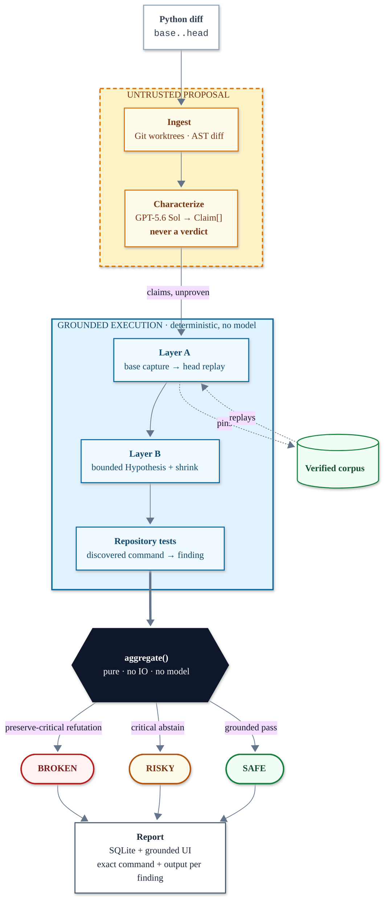

# OpenAI Build Week 2026 — Cross-Examine

> **Codex writes the code. Cross-Examine puts it on the stand.**
>
> Git worktrees → GPT-5.6 Sol claims → trusted-input base/head execution → pure `aggregate()` → FastAPI/React report.

<!-- Demo GIF slot: docs/assets/demo.gif -->

[](https://github.com/stefbuilds/cross-examine/actions/workflows/verify.yml)
[](pyproject.toml)
[](LICENSE)

[](https://cross-examine-six.vercel.app)

Cross-Examine is an independent verification harness for Codex-authored Python changes. It captures the base revision's behavior, executes the head revision against the same inputs, hunts adversarial boundaries, and shows the exact command and captured output behind every verdict.

Agent-authored code passes the tests that exist. Nothing checked whether the behavior it replaced still holds — so the model fixes one bug, introduces another, and the suite stays green throughout.

The catch is the product: a plausible optimization returns `None` for an empty list, the existing happy-path test stays green, and Cross-Examine produces `BROKEN` with `[]` as the reproducing input.

## Contents

- [Judge quickstart: see the catch in 60 seconds](#judge-quickstart-see-the-catch-in-60-seconds)
- [Why this is not a Codex skill](#why-this-is-not-a-codex-skill)
- [Architecture](#architecture)
- [Safety limitation](#safety-limitation)
- [Human decisions versus Codex decisions](#human-decisions-versus-codex-decisions)
- [License](#license)

Also in this repo: [requirements](#requirements) · [directory map](#directory-map) · [Windows setup](#windows-powershell-setup) · [real repository runs](#real-repository-run) · [tests](#tests) · [video outline](#three-minute-video-outline)

## Judge quickstart: see the catch in 60 seconds

The deterministic demo needs no API key and executes the real pipeline:

```bash
uv run --isolated --no-editable cross-examine demo --no-open
```

Expected receipt:

```text
Characterization: deterministic hero fixture
Verdict: BROKEN
Corpus: +2 this run · 2 total
Refuted claim: preserve-empty
Reproducing input: []
```

To inspect the same evidence in the product UI:

```bash
uv run cross-examine serve
```

Open `http://127.0.0.1:8765`, click **Run offline hero demo**, then expand the refuted finding. The exact command, base output, head output, expected value, actual value, and reproducing input are all rendered from the persisted report.

**Zero-install option:** the [live evidence explorer](https://cross-examine-six.vercel.app) serves an explicitly labeled, checked-in evidence fixture. Vercel Functions do not provide the Git and local-runtime capabilities required to execute repositories, so arbitrary repository analysis is intentionally local-only — the quickstart above runs the real five-stage pipeline.

## Why this is not a Codex skill

A skill is part of the system being judged. You cannot ask the suspect to be the jury. Cross-Examine is a separate process with a separate state store: it characterizes behavior Codex did not record, executes checks Codex did not write, applies a deterministic verdict function, and pins verified behavior into a corpus that outlives a single run.

A schema-constrained `Claim` is a contract, not a description. When the head fails, the report names the exact clause—`preserve-empty`—and the input that broke it—`[]`; prose has no clause to fail and cannot serve as an oracle. The intended-change abstention rule below follows from that same boundary.

## Architecture



1. **Ingest** resolves base and head into separate detached Git worktrees and discovers touched Python symbols.
2. **Characterize** asks GPT-5.6 Sol for strict `Claim` objects only. In the offline hero demo, a clearly labeled checked-in claim fixture replaces this one model call.
3. **Cross-examine** captures base behavior, replays it against head (Layer A), uses bounded Hypothesis generation and shrinking (Layer B), and executes conservatively discovered repository tests.
4. **Aggregate** is a pure function. A preserve-critical refutation is `BROKEN`; other refutations or critical abstentions are `RISKY`; grounded passes are `SAFE`.
5. **Render** reads the persisted `Report`, never free-form model prose, and reveals the exact command/output receipt for every finding.

See [docs/architecture.md](docs/architecture.md) for boundaries and failure behavior.

V1 deliberately abstains on intended-change correctness unless the contract has an independent executable oracle. Since model prose is never an oracle, any intended-change claim without one keeps the report at least `RISKY`; preservation checks and base-versus-head repository tests remain fully grounded.

## Safety limitation

This Build Week version is a trusted-input harness, not a hostile-code sandbox. Commands use argument vectors with `shell=False`, an executable allowlist, a minimal child environment that strips secret-shaped names, per-command and total-run deadlines, process-tree termination, a 2 MB output cap, and receipt redaction. Target code still executes locally. Use only repositories you trust; production requires real isolation and network denial.

The public Vercel deployment is an evidence explorer, not a repository runner. Its report is labeled **Hosted evidence fixture**, and arbitrary repository submissions are rejected with instructions to use the trusted-input local runner.

## GPT-5.6 and Codex usage

- **GPT-5.6 Sol (`gpt-5.6-sol`)** reads a bounded diff/source context and emits schema-constrained claims. It never emits verdicts. Malformed, duplicate, unknown-symbol, or verdict-injecting output is rejected.
- **Codex** authored and iterated this application: the Python pipeline, tests, React UI, CLI, packaging, documentation, and verification flow. Cross-Examine remains independent at run time; deterministic execution and `aggregate()` judge a change.

## Human decisions versus Codex decisions

The human retained product authority; Codex accelerated implementation.

| Human-provided doctrine | Codex-chosen implementation |
| --- | --- |
| Problem selection and Python-only scope | FastAPI / SQLite / React stack |
| The contract and five-stage structure | Worktree and subprocess mechanics |
| Abstain-toward-risk policy | Edge catalog and Hypothesis bounds |
| Layer-A-before-Layer-B sequencing | Persistence and SSE protocol |
| Trusted-input execution boundary | CLI surface and deterministic hero construction |
| Build Week deadline | 21st.dev component selection and adaptation |
| Requirement to use 21st.dev at design time | Responsive behavior, tests, packaging |
| Evidence doctrine and final submission story | Cross-platform diagnosis, release verification |

The exact UI-source provenance is recorded in [docs/provenance.md](docs/provenance.md). The Build Week work is visible in the dated Git history and the primary Codex task supplied with the Devpost submission. GPT-5.6 is a deliberately constrained runtime component rather than the judge: it proposes behavioral claims, while execution and a pure deterministic function decide the outcome.

## Requirements

| Requirement | Notes |
| --- | --- |
| Python | 3.12+ |
| Git | |
| [uv](https://docs.astral.sh/uv/) | |
| Node.js | 20.19+ only when rebuilding or testing the React frontend |
| Playwright Chromium | for the packaged browser verification (`npx playwright install chromium`) |
| `OPENAI_API_KEY` | for real-repository characterization; the hero demo works offline |

The release workflow verifies Python 3.12 on Windows, macOS, and Ubuntu. Repository targets are Python-only during Build Week. The local runner executes target code, so use only repositories you trust.

## Directory map

| Path | What's there |
| --- | --- |
| `src/cross_examine/` | The Python package: pipeline stages, schemas and validation, execution controls, persistence, CLI, fixtures, and FastAPI application. |
| `frontend/` | React/Vite evidence-explorer source, UI components, frontend tests, and browser end-to-end tests. |
| `api/` | Vercel entry point that exposes the packaged application. |
| `scripts/` | Hero-repository builder, real-repository trial runner, and cross-platform verification scripts. |
| `tests/` | Python unit, integration, end-to-end, release, and hero-repository fixture tests. |
| `docs/` | Architecture, demo, execution policy, provenance, submission, trial evidence, and probe-plan documentation. |

## Windows PowerShell setup

```powershell
uv sync --extra dev
Push-Location frontend
npm ci
npm run build
Pop-Location
uv run --isolated --no-editable cross-examine demo --no-open
uv run cross-examine serve
```

Open the printed run URL. The packaged FastAPI server hosts both the API and React application, so direct `/runs/{id}` links work. The **Runs** destination lists the 50 most recent persisted runs after a restart.

The UI's **Run offline hero demo** action creates the stable `hero-base` and `hero-head` repository automatically. Its claim source is visibly labeled `deterministic hero fixture`; every finding and verdict still comes from real execution.

## Real repository run

```powershell
$env:OPENAI_API_KEY = "..."
uv run cross-examine run C:\code\your-python-repo --base main --head feature/candidate
uv run cross-examine serve
```

Use `--no-layer-b` for a Layer-A-only compatibility pass. The web form accepts a local path or Git URL and streams stage progress over SSE.

## Tests

The complete judge-facing verification is available on every supported platform.

On macOS or Linux:

```bash
bash scripts/verify.sh
```

On Windows:

```powershell
powershell -ExecutionPolicy Bypass -File scripts/verify.ps1
```

Both entry points remove `OPENAI_API_KEY` from child processes, set `CROSS_EXAMINE_DEMO_CHARACTERIZER=fixture`, sync locked dependencies, run Ruff, all Python tests, frontend lint and contract/accessibility tests, the production build, the packaged Playwright receipt flow, and the offline hero demo.

The dev extra pins `httpx2` because the installed Starlette `TestClient` imports it directly and emits a deprecation warning when falling back to legacy `httpx`.

## Three-minute video outline

- **0:00–0:30 — the catch:** confident PR, `BROKEN`, open `[]`, exact command, captured difference.
- **0:30–1:05 — independence:** why a second process and pure aggregation matter.
- **1:05–1:50 — five stages:** live progress from Ingest through Aggregate.
- **1:50–2:20 — state moat:** rerun and show corpus growth/deduplication.
- **2:20–2:45 — real repository:** one unseen Python change, Layer A first.
- **2:45–3:00 — impact:** trustworthy unattended agentic coding.

The exact shot and voiceover script is in [docs/demo.md](docs/demo.md).

## License

[MIT](LICENSE)
