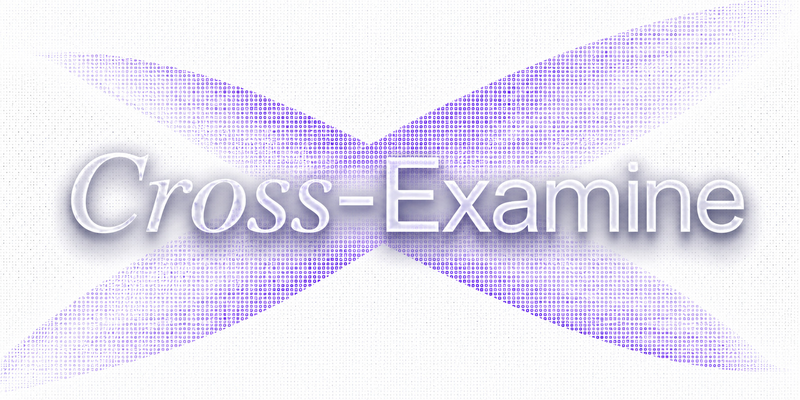
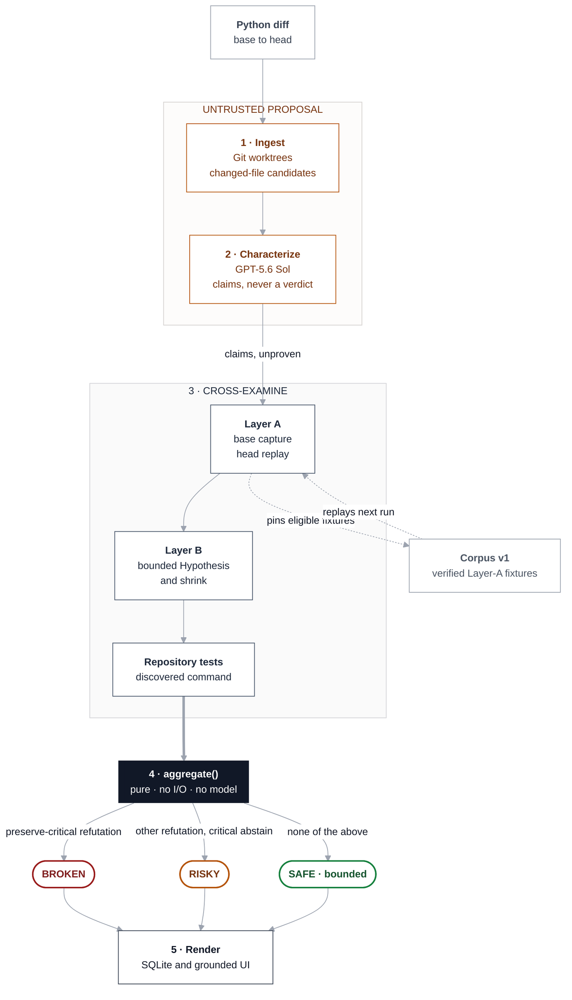

# Cross-Examine

> **Codex writes the code. Cross-Examine puts it on the stand.**
>
> OpenAI Build Week 2026 · **Track: Developer tools** (testing · agentic workflows)
>
> Git worktrees → GPT-5.6 Sol claims → trusted-input base/head execution → pure `aggregate()` → FastAPI/React report.

<!-- Demo GIF slot: docs/assets/demo.gif -->

[](https://github.com/stefbuilds/cross-examine/actions/workflows/verify.yml)
[](pyproject.toml)
[](LICENSE)

[](https://cross-examine-six.vercel.app)

**The problem.** Agent-authored code passes the tests that exist. Nothing checks whether the
behavior it replaced still holds — so the model fixes one bug, introduces another, and the
suite stays green throughout. Anyone merging Codex-authored pull requests is reviewing a
diff with no evidence about the behavior that diff silently changed.

**The tool.** Cross-Examine is an independent verification harness for Codex-authored Python
changes. It captures the base revision's behavior, executes the head revision against the
same inputs, and hunts adversarial boundaries. Newly executed reports that pass pipeline
validation show the exact command and captured output behind every `VERIFIED` or `REFUTED`
finding. Abstentions show attempted evidence or a deterministic diagnostic instead of
fabricating a receipt.

**The catch is the product.** A plausible optimization returns `None` for an empty list, the
existing happy-path test stays green, and Cross-Examine returns `BROKEN` with `[]` as the
reproducing input — reproducible in 60 seconds from a clean checkout by the command below.

## Contents

- [Judge quickstart: see the catch in 60 seconds](#judge-quickstart-see-the-catch-in-60-seconds)
- [How Codex and GPT-5.6 were used](#how-codex-and-gpt-56-were-used)
- [Why this is not a Codex skill](#why-this-is-not-a-codex-skill)
- [Architecture](#architecture)
- [Scope and safety](#scope-and-safety)
- [License](#license)

Also in this repo: [requirements](#requirements) · [directory map](#directory-map) · [Windows setup](#windows-powershell-setup) · [real repository runs](#real-repository-run) · [tests](#tests) · [video outline](#three-minute-video-outline)

## Judge quickstart: see the catch in 60 seconds

On macOS or Linux, allocate a fresh workspace, clear ambient model and run-storage
variables, and force the checked-in characterization fixture. The findings still come
from the real local pipeline:

```bash
hero_workspace=$(mktemp -d)
env -u OPENAI_API_KEY -u CROSS_EXAMINE_DB -u CROSS_EXAMINE_RUNS CROSS_EXAMINE_DEMO_CHARACTERIZER=fixture \
  uv run --isolated --no-editable cross-examine demo --no-open \
  --workspace "$hero_workspace"
```

The first run in that new workspace reports:

```text
Characterization: deterministic hero fixture
Verdict: BROKEN
Corpus: +2 this run · 2 total
Refuted claim: preserve-empty
Reproducing input: []
```

Run the same credential-cleared command again with the same `hero_workspace`. The
verdict remains `BROKEN`; corpus output becomes `+0 this run · 2 total`. A new workspace
is what makes the advertised first-run `+2` exact.

To inspect the same evidence in the product UI:

```bash
env -u OPENAI_API_KEY \
  CROSS_EXAMINE_DB="$hero_workspace/cross-examine.db" \
  CROSS_EXAMINE_RUNS="$hero_workspace/runs" \
  uv run cross-examine serve
```

Open the run URL printed by the terminal command, then expand the refuted finding. This
server reads the same workspace-local database and run root, so the exact command, base
output, head output, expected value, actual value, and reproducing input come from that
pipeline-validated persisted report.

**Test it without building anything.** The [live evidence explorer](https://cross-examine-six.vercel.app)
is a deployed demo instance — no clone, no install, no API key. It serves an explicitly
labeled, checked-in evidence fixture so the report UI, the exact-command receipts, and the
verdict surface can be inspected directly in a browser. Vercel Functions do not provide the
Git and local-runtime capabilities required to execute repositories, so arbitrary repository
analysis is intentionally local-only — the quickstart above runs the real five-stage pipeline.

**Supported platforms.** macOS, Linux, and Windows. The commands above are macOS/Linux; the
equivalent [Windows PowerShell setup](#windows-powershell-setup) is below. CI exercises
Python 3.12 on all three.

## How Codex and GPT-5.6 were used

**Where Codex accelerated the work.** Codex authored and iterated the whole application:
the Python pipeline, the schema and validation layer, execution controls, SQLite
persistence, the FastAPI service, the React evidence explorer, the CLI, packaging, the
cross-platform verification scripts, and the test suite. It also did the work that is easy
to underestimate — diagnosing a Windows `cp1252` child-encoding failure, a pytest-cache
rename denial in detached worktrees, and the dependency-shaped false positives documented
in [docs/trials.md](docs/trials.md) — each of which changed the execution policy rather
than just the code. The dated Git history and the Codex session supplied with the Devpost
submission show that progression.

**Where the key decisions were made.** The human held product authority throughout; Codex
chose the implementation. The split was deliberate and is the reason the verdict is
trustworthy: every doctrine on the left constrains what the code on the right is allowed
to conclude.

| Human-provided doctrine | Codex-chosen implementation |
| --- | --- |
| Problem selection and Python-only scope | FastAPI / SQLite / React stack |
| The contract and five-stage structure | Worktree and subprocess mechanics |
| Abstain-toward-risk policy | Edge catalog and Hypothesis bounds |
| Layer-A-before-Layer-B sequencing | Persistence and SSE protocol |
| Trusted-input execution boundary | CLI surface and deterministic hero construction |
| Build Week deadline | Component selection and adaptation |
| Interface design requirement | Responsive behavior, tests, packaging |
| Evidence doctrine and final submission story | Cross-platform diagnosis, release verification |

**How GPT-5.6 is used at run time.** GPT-5.6 Sol (`gpt-5.6-sol`) reads bounded diff and
source context and emits schema-constrained Claims plus optional ProbePlans. It never emits
an outcome or a verdict. Malformed, duplicate, unknown-target, and forbidden structured
fields are rejected, and proposal text stays untrusted. The model is a deliberately
constrained component rather than the judge — it proposes behavioral claims, while
model-free execution supplies the evidence and a pure deterministic `aggregate()` decides
the product verdict.

## Why this is not a Codex skill

A skill is part of the system being judged. You cannot ask the suspect to be the jury.
Cross-Examine is a separate process with a separate state store: it proposes and executes
checks, then applies a deterministic verdict function. Corpus v1 persists verified Layer-A
fixtures and replays them by repository locator and symbol.

A schema-constrained `Claim` is an untrusted proposal, not an oracle. Characterization
may also propose an optional untrusted `ProbePlan`; neither can carry an outcome or
verdict. Executed base behavior and deterministic policy, not claim prose, decide a
preservation finding. The intended-change abstention rule below follows from that same
boundary.

## Architecture



The untrusted zone is model-authored and schema-constrained: it may propose, never
conclude. Characterize is the only stage that contacts a model over the network; every
execution stage is offline, model-free, bounded, and deterministic. The numbered stages
match the five steps below.

1. **Ingest** resolves base and head into detached Git worktrees and catalogues class,
   function, async, and nested candidate definitions in changed Python files. This is
   file-level discovery, not changed-line precision.
2. **Characterize** asks GPT-5.6 Sol for strict Claims and optional ProbePlans. Both are
   untrusted proposals. In the offline hero, a labeled checked-in Claim fixture replaces
   the model call.
3. **Cross-examine** replays captured base behavior against head, then runs a bounded
   Hypothesis search for edge cases. It probes synchronous callables with JSON-compatible
   inputs; anything outside that set abstains rather than guesses.
4. **Aggregate** is a pure function. A preserve-critical refutation is `BROKEN`; other
   refutations, critical abstentions, or missing critical claims are `RISKY`.
5. **Render** reads the persisted `Report`. `VERIFIED` and `REFUTED` findings open to an
   exact command and captured output; abstentions show a deterministic diagnostic.

See [docs/architecture.md](docs/architecture.md) for boundaries and failure behavior.

V1 deliberately abstains on intended-change correctness unless the proposal has an
independent executable oracle. Since model prose is never an oracle, a represented
intended-change claim without one keeps the report at least `RISKY`.

## Scope and safety

> **`SAFE` means bounded, not proven.** It reports that nothing was refuted among the
> checks that actually ran — not that the pull request is correct.

Cross-Examine executes the target repository's code, so point it only at repositories you
trust. Commands run through argument vectors with `shell=False`, an executable allowlist,
a minimal child environment that strips secret-shaped variables, deadlines, a 2 MB output
cap, and receipt redaction. Those controls bound the harness itself, not code the target
spawns — production use needs real isolation. Serve on `127.0.0.1`.

The public [evidence explorer](https://cross-examine-six.vercel.app) is exactly that: it
serves a labeled, checked-in fixture so the report UI and its receipts can be inspected
without installing anything. Executing a repository needs Git and a local runtime, so
that path runs locally by design.

## Requirements

| Requirement | Notes |
| --- | --- |
| Python | 3.12 is tested; package metadata currently permits `>=3.12` |
| Git | |
| [uv](https://docs.astral.sh/uv/) | |
| Node.js | 20.19+ only when rebuilding or testing the React frontend |
| Playwright Chromium | for the packaged browser verification (`npx playwright install chromium`) |
| `OPENAI_API_KEY` | for real-repository characterization; the hero demo works offline |

CI is configured for Python 3.12 on Windows, macOS, and Ubuntu. Cite an immutable green
run before calling that matrix verified. Repository targets are Python-only during Build
Week. The local runner executes target code, so use only repositories you trust.

## Code tour

The package is laid out as the five stages, in order. To read it end to end, start at
`pipeline.py` — it orchestrates all five and is the only file you need to follow the whole
flow.

| Stage | Where it lives | Start here |
| --- | --- | --- |
| Orchestration | `src/cross_examine/pipeline.py` | `Pipeline.run()` — all five stages in one method |
| 1 · Ingest | `src/cross_examine/ingest/` | `service.py` resolves worktrees, `symbols.py` finds candidates |
| 2 · Characterize | `src/cross_examine/characterize/` | `models.py` is the schema the model must satisfy |
| 3 · Cross-examine | `src/cross_examine/cross_examine/` | `layer_a.py` (base capture / head replay), `layer_b.py` (bounded search) |
| 4 · Aggregate | `src/cross_examine/schema.py` | **`aggregate()`** — 16 lines, pure, no I/O; the verdict lives here |
| 5 · Render | `src/cross_examine/api/`, `persistence/` | `app.py` serves the report the React app reads |
| Execution boundary | `src/cross_examine/execution.py` | every subprocess the harness runs goes through here |

If you only read one function, read `aggregate()` in `schema.py`. It is the whole
argument of the project: the verdict is a pure function of executed findings, so no model
output can reach it.

## Directory map

| Path | What's there |
| --- | --- |
| `src/cross_examine/` | The Python package: pipeline stages, schemas and validation, execution controls, persistence, CLI, fixtures, and FastAPI application. |
| `frontend/` | React/Vite evidence-explorer source, UI components, frontend tests, and browser end-to-end tests. |
| `api/` | Vercel entry point that exposes the packaged application. |
| `scripts/` | Hero-repository builder, real-repository trial runner, and cross-platform verification scripts. |
| `tests/` | Python unit, integration, end-to-end, release, and hero-repository fixture tests. |
| `docs/` | Architecture, demo, execution policy, provenance, submission, trial evidence, and probe-plan documentation. |

## Windows PowerShell setup

```powershell
uv sync --extra dev
Push-Location frontend
npm ci
npm run build
Pop-Location
$env:CROSS_EXAMINE_DEMO_CHARACTERIZER = "fixture"
Remove-Item Env:OPENAI_API_KEY -ErrorAction SilentlyContinue
Remove-Item Env:CROSS_EXAMINE_DB -ErrorAction SilentlyContinue
Remove-Item Env:CROSS_EXAMINE_RUNS -ErrorAction SilentlyContinue
$heroWorkspace = Join-Path ([System.IO.Path]::GetTempPath()) ("cross-examine-hero-" + [Guid]::NewGuid())
uv run --isolated --no-editable cross-examine demo --no-open --workspace $heroWorkspace
$env:CROSS_EXAMINE_DB = Join-Path $heroWorkspace "cross-examine.db"
$env:CROSS_EXAMINE_RUNS = Join-Path $heroWorkspace "runs"
uv run cross-examine serve
```

Repeat the same demo command with the same `$heroWorkspace` to see `+0 this run · 2
total` after the fresh run's `+2 this run · 2 total`.

Open the printed run URL. The packaged FastAPI server hosts both the API and React
application, so direct `/runs/{id}` links work. Completed reports persist; worker queues
and SSE history are in memory, and stale queued/running work is not resumed after restart.

The UI's **Run offline hero demo** action creates the stable `hero-base` and `hero-head`
repository automatically. Its claim source is visibly labeled `deterministic hero
fixture`; decided findings still require real execution, and deterministic code owns the
verdict.

## Real repository run

```powershell
$env:OPENAI_API_KEY = "..."
uv run cross-examine run C:\code\your-python-repo --base main --head feature/candidate
uv run cross-examine serve
```

Use `--no-layer-b` for a Layer-A-only compatibility pass. The web form accepts a local path or Git URL and streams stage progress over SSE.

## Tests

The repository's current verification entry points are:

On macOS or Linux:

```bash
bash scripts/verify.sh
```

On Windows:

```powershell
powershell -ExecutionPolicy Bypass -File scripts/verify.ps1
```

Both entry points remove `OPENAI_API_KEY`, `CROSS_EXAMINE_DB`, and
`CROSS_EXAMINE_RUNS` from child processes, force the fixture, sync locked dependencies,
and run the current backend/frontend/build checks. Each owns a temporary demo workspace
and asserts a fresh `BROKEN/+2/2` run followed by `BROKEN/+0/2`. The POSIX script also
asserts checked-in static-bundle equality; the PowerShell script builds and tests the
bundle but does not perform the same byte-drift assertion.

Coverage is Python 3.12 across Windows, macOS, and Ubuntu: unit, integration, end-to-end,
and release tests on the backend; component, accessibility, and two Chromium flows on the
frontend.

## Three-minute video outline

Submission constraints: a public YouTube video under three minutes, with audio that
explicitly covers how both Codex and GPT-5.6 were used.

- **0:00–0:19 — the problem:** agent-written tests pass because they test the code that was
  just written; nothing checks the behavior it replaced.
- **0:19–0:52 — the catch:** run the offline hero demo, land on `BROKEN`.
- **0:52–1:16 — the receipt:** open the refuted finding — exact command, base output vs
  head output, reproducing input `[]`.
- **1:16–1:41 — independence:** the model proposes claims; execution and a pure
  `aggregate()` decide.
- **1:41–1:53 — repeat run:** `+0 this run · 2 total`.
- **1:53–2:22 — Codex and GPT-5.6 (required narration):** what Codex authored, the
  cross-platform defects it caught, which decisions stayed human, and GPT-5.6's single
  constrained runtime job.
- **2:22–2:38 — scope and impact:** `SAFE` is bounded; verdicts on agent-written code
  should come from execution.

The exact shot and voiceover script is in [docs/demo.md](docs/demo.md).

## License

[MIT](LICENSE)
