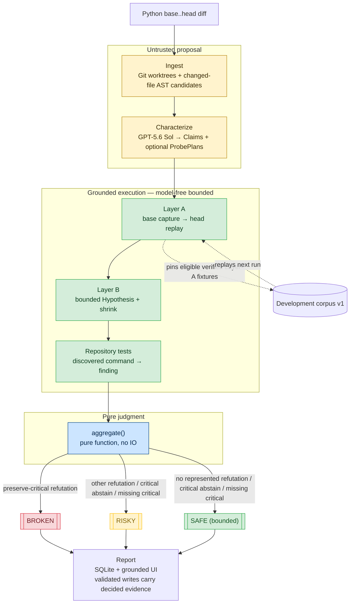

# Architecture and trust boundaries

Cross-Examine is contract-first. The renderer consumes `Report`; every upstream stage
exists only to produce that structure. The model proposes schema-constrained Claims and
optional ProbePlans, model-free bounded execution produces findings, and deterministic
code decides the verdict. The authoritative implementation status and measurable exits
are in [the capability matrix](capability-status.md).

## Contract ownership

- `schema.py` owns `Claim`, `Finding`, `Report`, the enums, and pure `aggregate()`.
- `validation.py` rejects a newly pipeline-validated `VERIFIED` or `REFUTED` finding
  without command, output, and a structurally valid command/output receipt before the
  completed report is written. Legacy or otherwise unvalidated stored reports are not
  revalidated on read by the current persistence/API path and can still reach Render.
- `codec.py` serializes the current JSON-shaped report fields; it is not a versioned,
  lossless semantic codec.
- `persistence/` owns SQLite records; it does not decide outcomes.
- The React application renders the current verdict, finding, command/output, and
  receipt subset. It does not expose generic `Finding.provenance` or execution manifests.

Adversarial verification of model output has largely converged on debate, prover-verifier, and LLM-as-judge. All three terminate in a model deciding who won. Cross-Examine substitutes execution for the judge: the model proposes schema-constrained claims, subprocesses produce the evidence, and a pure function decides. The adversary cannot be argued with.

Each newly pipeline-validated decided finding carries one or more `EvidenceReceipt`
values. The execution boundary hashes the canonical invocation and captured output;
`validate_report()` recomputes the hash and uses substring inclusion to require the
receipt command and output in the finding's rendered evidence before a new completed
report is persisted. Legacy or otherwise unvalidated stored reports are not revalidated
on read, so existing or injected DB/API records may still render receiptless or
semantically unvalidated decided findings. Receipt v1 can detect command/output
hash corruption or missing displayed substrings on the validated write path. It does not
bind repository identity, revision role,
input, expected value, execution policy, runtime, manifest, claim/finding linkage, IDs,
or verdict; it is context-free, unauthenticated metadata rather than semantic validation
or attestation. The executor remains a trusted host-process adapter, so malicious target
code or a compromised host is outside this Build Week threat model.

Layer B is a bounded differential search over supported preserve-critical claims. Its 60
deterministic Hypothesis examples and shrinking can find counterexamples; exhaustion is
not proof of compatibility. Any future benchmark work keeps admission, witness replay,
and scoring outside `aggregate()`, so verdict semantics stay independent of it.

## Execution boundary

Git and Python commands are passed as argument arrays with `shell=False`. The
trusted-input boundary allowlists the top-level executable basename used by the harness;
it does not constrain commands spawned by target Python. Child processes inherit only
required OS/runtime variables; secret-shaped names, API keys, credential helpers, and
SSH-agent configuration are absent even when ambient in the operator session. Receipts
still redact known secret values defensively. Output is capped at 2 MB, and each command
is bounded by its own timeout and the run's monotonic deadline. The effective supported
command timeout is 120 seconds even though the API currently accepts larger values.
Timeout handling attempts best-effort process-tree cleanup. Base and head execute from
detached worktrees.

An `ExecutionManifest` is returned to the immediate caller for a successfully launched
child, but v1 does not persist or render it in `Report`, SQLite export, CLI output, or
React. The only supported service posture is `127.0.0.1`; the CLI does not enforce that
posture. Binding to a non-loopback address exposes unauthenticated trusted-host execution
endpoints and is unsupported and unsafe.

This is deliberate hackathon scope. It reduces accidental damage and command injection; it does not isolate malicious target code. A production service must run targets inside disposable, network-restricted VMs or containers with resource quotas.

## Characterization boundary

GPT-5.6 Sol receives bounded diff and source context and must parse into strict Pydantic
models with extra fields forbidden. Claims must target catalogued candidate definitions;
duplicate IDs, flood limits, invalid references, and forbidden structured fields such as
verdicts are rejected. Claim text remains untrusted display data. The model cannot emit
`Finding`, `Outcome`, or `Verdict` values, but the adapter does not currently require one
claim for every discovered candidate.

The CLI hero demo uses `HeroCharacterizer` when `OPENAI_API_KEY` is absent. The browser's explicit `POST /api/hero-runs` path always uses that checked-in characterizer and labels its `proposed_check` as `deterministic hero fixture`; arbitrary repository submissions never receive a silent model substitute. All hero findings still come from real base/head execution.

Claims declare whether they describe preservation or an intended change. Base/head equality can verify preservation, but it can never verify an intended change. V1 has no safe mechanism for linking a repository test to one specific model-authored intended-change claim, so such a claim stays critical `UNVERIFIABLE` and the report cannot be `SAFE`. This is a deliberate abstention boundary; a later contract can add explicit allowlisted oracle references without treating model prose as expected behavior.

## Failure semantics

Most stage exceptions become synthetic preserve-critical `UNVERIFIABLE` findings with a
deterministic diagnostic. A known aggregation-validation recursion path is not yet
universally converted. Each discovered pytest command runs with the product interpreter
and source-tree path injection. After the base passes, a passing head is `VERIFIED`; a
head failure is `REFUTED` only when the heuristic diagnostic is not recognized as a
dependency/setup failure. Pre-existing failures, missing modules, absent extras,
timeouts, and truncation are `UNVERIFIABLE`.

Aggregation itself resolves represented critical abstentions toward risk, but current
coverage and classification gaps prevent a universal guarantee: characterization can
omit a discovered candidate entirely, and a model-controlled non-critical preservation
mismatch can become `UNVERIFIABLE` without preventing `SAFE`. Current `SAFE` therefore
means only that pure `aggregate()` received no represented refutation, no critical
abstention, and no missing critical claim among the characterized, represented,
supported checks supplied to it.

## Concurrency and persistence

The local API runs one background verification worker so concurrent submissions queue
instead of competing for local CPU and worktrees. Progress snapshots and completed
reports are persisted. SSE event history, the worker queue, and active tasks are
process-local; a reconnect can fall back to the latest persisted run record, but stale
queued or running jobs are not deterministically recovered after restart.
`GET /api/runs` exposes a bounded newest-first history, and completed reports survive
process restarts.

## Corpus identity

Corpus v1 keys an eligible verified Layer-A check by the supplied repository locator,
target symbol, canonical input, and expected base result. Later runs select by literal
locator and symbol, without Git identity, ancestry, or inherited-base revalidation.
Duplicate pins update mutable evidence in place; the total row count remains stable, but
the current latest-growth query can count touched duplicate rows as growth. Corpus v2
owns immutable observations, conservative migration, Git authority, and atomic
run/corpus completion.
