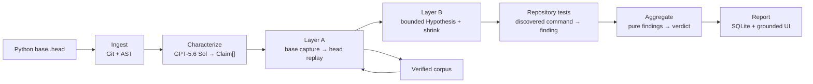

# Architecture and trust boundaries

Cross-Examine is contract-first. The renderer consumes `Report`; every upstream stage exists only to produce that structure. The model proposes claims, execution produces findings, and deterministic code decides the verdict.

## Contract ownership

- `schema.py` owns `Claim`, `Finding`, `Report`, the enums, and pure `aggregate()`.
- `validation.py` prevents a verified/refuted finding without command and output from reaching Render.
- `codec.py` is the lossless persistence boundary.
- `persistence/` owns SQLite records; it does not decide outcomes.
- The React application mirrors, but does not reinterpret, the Python report contract.

## Execution boundary

Git and Python commands are passed as argument arrays with `shell=False`. The trusted-input boundary allows only Git, Python, and the active interpreter. Child processes inherit only required OS/runtime variables; secret-shaped names, API keys, credential helpers, and SSH-agent configuration are absent even when ambient in the operator session. Receipts still redact known secret values defensively. Output is capped at 2 MB, every command is bounded by both its own timeout and the run's monotonic deadline, and timeout kills the process tree. Base and head execute from detached worktrees.

This is deliberate hackathon scope. It reduces accidental damage and command injection; it does not isolate malicious target code. A production service must run targets inside disposable, network-restricted VMs or containers with resource quotas.

## Characterization boundary

GPT-5.6 Sol receives bounded diff and source context and must parse into strict Pydantic models with extra fields forbidden. Claims must target discovered symbols and pass duplicate/flood/injection checks. The model cannot emit `Finding`, `Outcome`, or `Verdict` values.

The CLI hero demo uses `HeroCharacterizer` when `OPENAI_API_KEY` is absent. The browser's explicit `POST /api/hero-runs` path always uses that checked-in characterizer and labels its `proposed_check` as `deterministic hero fixture`; arbitrary repository submissions never receive a silent model substitute. All hero findings still come from real base/head execution.

Claims declare whether they describe preservation or an intended change. Base/head equality can verify preservation, but it can never verify an intended change. V1 has no safe mechanism for linking a repository test to one specific model-authored intended-change claim, so such a claim stays critical `UNVERIFIABLE` and the report cannot be `SAFE`. This is a deliberate abstention boundary; a later contract can add explicit allowlisted oracle references without treating model prose as expected behavior.

## Failure semantics

Every stage exception becomes a synthetic preserve-critical `UNVERIFIABLE` finding with a grounded diagnostic. Each discovered pytest command runs identically on base and head using the product interpreter. A passing head is `VERIFIED`; a head failure is `REFUTED` only when base passed and the head diagnostic is not a concrete dependency/setup failure. Pre-existing failures, missing modules, absent extras, timeouts, and truncation are `UNVERIFIABLE`. Aggregation resolves toward risk. No stage failure is hidden and no missing critical execution can produce `SAFE`.

## Concurrency and persistence

The local API runs one background verification worker so concurrent submissions queue instead of competing for local CPU and worktrees. Progress is persisted before publication. SSE streams in-memory history for live clients; a reconnect falls back to the persisted run record. `GET /api/runs` exposes a bounded newest-first history, and completed reports survive process restarts.

## Corpus identity

A pinned check is keyed by the repository, target symbol, canonical input, and expected base result. Only verified Layer-A checks pin. Later runs replay applicable checks, and identical behavior updates its last-seen run without inflating the corpus total.
