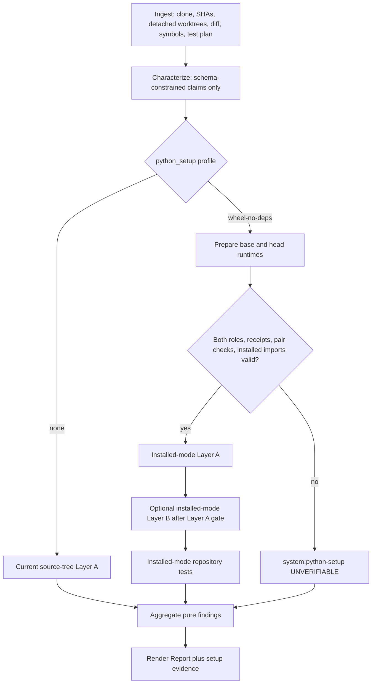

# Deterministic Python setup contract: implementation handoff

## Superseding status — 2026-07-19

- **Historical source:** the original Phase 0 research is preserved verbatim at commit
  `5bea8baf5f031d9bfdff592b3e85e001842c651b`.
- **Applies-to snapshot:** this handoff describes the 2026-07-18 Phase 0 working-tree
  design/audit snapshot and declares no product implementation pin. It is distinct from
  current product commit `c3daef6d428aa775fae29b5f327c12dc6c2f3c4b`.
- **Current state:** the deterministic setup contract is `future`; no SetupPlan,
  prepared revision environments, installed Layer A, installed repository tests, or
  setup persistence is implemented.
- **Dependency gate:** P2 current-integrity work must fail closed first; P3 then owns
  the versioned `none` and `wheel-no-deps` contract, with installed Layer A working end
  to end before any matching Layer B extension. This design grants no setup or
  isolation authority.
- **Current truth:** see the authoritative [capability status](../capability-status.md).
  The original prose below remains historical design evidence, not current
  implementation.

**Status:** Recommended; not blocked. The contract below preserves the existing
trusted-input host-process boundary. It does not make target repositories safe,
hermetic, offline, or sandboxed.

**Decision:** Add one opt-in, operator-selected, versioned setup profile:
`wheel-no-deps`. Keep `none` as the byte-for-byte-compatible default. Product
code owns every argv element. The model, repository, API caller, and CLI caller
cannot provide commands, argv fragments, installer flags, environment values,
URLs, extras, or project subdirectories.

`wheel-no-deps` builds and installs each revision into its own run-owned Python
environment, proves that target imports resolve from that environment rather
than either checkout, and binds every setup and later execution receipt to the
corresponding revision environment. Both sides must finish the same versioned
plan before any behavioral comparison runs. Any missing, asymmetric, failed, or
unprovable setup becomes one preserve-critical `UNVERIFIABLE` finding and gates
all probes, tests, Layer B work, and corpus pinning.

This is the smallest useful contract because it addresses the concrete trial
gap—source trees that need a build/install step to become importable—without
adding dependency resolution or a general-purpose command language.

## Non-negotiable invariants

1. Only deterministic product code constructs setup argv. There is no string,
   argv, flag, module, environment, URL, extra, lockfile, script, or template
   field in model output, `RunSpec`, HTTP input, or CLI input.
2. The operator selects only a closed profile ID. The repository cannot select,
   recommend, or activate a profile through `pyproject.toml` or another file.
3. `none` preserves the current product interpreter, `PYTHONPATH`, stage order,
   reports, and Layer A behavior. Missing setup input always means `none`.
4. `wheel-no-deps` uses the same plan version, logical argv templates, active
   interpreter identity, limits, environment policy, adapter, and phase order
   for base and head. Only role-owned paths and resolved revision SHA differ.
5. Base and head have separate environment, artifact, cache, and state roots.
   Nothing is installed into the product interpreter or a shared target venv.
6. Setup is an atomic Cross-examine preflight after Characterize. Both roles and
   every symmetry/import check pass before capture, replay, probe plans, Layer B,
   repository tests, or corpus pinning begins.
7. A setup failure never falls back to source imports, the product interpreter,
   ambient `PYTHONPATH`, a shared environment, a looser installer mode, network
   resolution, or operator/model-generated commands.
8. Setup failure is never a refutation. It creates exactly one
   preserve-critical `system:python-setup` `UNVERIFIABLE` finding and therefore
   resolves to `RISKY` through the unchanged pure `aggregate()` function.
9. Every attempted subprocess goes through the bounded host runner with
   `shell=False`, the run deadline, per-command timeout, output cap, redaction,
   process cleanup, and a context-bound receipt. Validation-only failures have a
   typed non-command attempt record; they do not invent an execution receipt.
10. A venv separates Python package state only. Build hooks and target code retain
    the operator account's filesystem, process, service, and network authority.
    `pip --no-index` suppresses pip index resolution; it is not network denial.
11. Installed mode proves each claimed target module resolves below the correct
    role venv's `site-packages` and outside both worktrees. Pytest and probes must
    not prepend either checkout. Failure to prove this is setup failure.
12. Layer A with `wheel-no-deps` must pass end-to-end before Layer B support for
    the profile is enabled. Layer B may not silently reuse source-tree semantics.

## Discovery: current flow and gap

The current working tree already contains in-progress receipt hardening; this
handoff treats those edits as authoritative and does not replace them.

Current execution is:

1. `IngestService.ingest()` clones the repository, resolves both SHAs, creates
   detached `base` and `head` worktrees, captures the diff, discovers symbols,
   and emits a conservative pytest argv when Python test markers are present.
2. Characterize receives bounded diff/source context and returns strict claims.
   It has no setup authority.
3. Layer A and the probe-plan path call the product `sys.executable` and set
   `CROSS_EXAMINE_WORKTREE`; `probe_runner._prepare_import_path()` prepends the
   checkout root and `src` directory.
4. Layer B starts a product-interpreter worker whose nested probes also use its
   interpreter and inject each worktree path.
5. Repository tests replace discovered `python` with the product interpreter and
   set `PYTHONPATH` to the worktree's `src` and root. The same test argv runs base
   first and then head, and exact output from both is rendered in one finding.
6. `run_command()` uses argv with `shell=False`, a basename allowlist, bounded CWD
   and environment, deadlines/output limits, redaction, a manifest, and exact
   captured stdout/stderr. Current structural receipts bind command and output.
7. Stage exceptions become critical abstentions. `aggregate()` is pure and risk
   seeking for missing or unverifiable critical coverage.

This works for importable source checkouts. It cannot see files generated only
by a build/install step, and it deliberately abstains when optional dependencies
are absent. `docs/trials.md` records both cases. External provisioning such as
`uv run --with text-unidecode ...` currently affects both revisions through the
shared product interpreter but is not a first-class, captured setup contract.

Two existing controls must not be overread when setup is added:

- Executable validation currently compares basenames. An arbitrary absolute file
  named `python` can satisfy that check; prepared venv interpreters therefore need
  exact resolved-path and digest binding before every launch.
- A manifest's CWD digest currently hashes the resolved path string, not the
  directory contents. It is an identity label, not a source snapshot proof.

## Alternatives considered

| Design | Authority | Pair symmetry | Useful scope | Decision |
| --- | --- | --- | --- | --- |
| Closed declarative profile | Operator chooses an enum; product owns fixed argv | Canonical plan can be applied and compared role-for-role | Standard root Python projects needing a wheel/install step | **Use** |
| Operator-approved argv | Operator supplies arbitrary argv or a templated sequence | Hard to canonicalize; placeholders become a command language | Broad escape hatch | Reject from v1; it is trusted scripting, not this contract |
| Isolated environment adapter only | Internal mechanism, not a public setup policy | Can isolate package state if driven by a closed plan | Venv now; container/VM later | Use behind the profile, not as the contract itself |

### Why raw operator argv is rejected

An operator approval boundary would prevent the model from directly authoring a
command, but it would still turn the API into a general execution source.
`python -c`, arbitrary `-m` modules, response files, pip configuration, direct
references, path-selected executables, and installer flags can all execute code.
It would also require a placeholder/substitution language to run “the same”
command against two revisions. That is larger and less auditable than the problem.

If a future local-only expert escape hatch is added, classify it explicitly as
operator scripting outside deterministic profiles. It must not share this API,
must never be generated from characterization/repository text, and needs its own
approval, provenance, and threat review.

### Why containers/VMs are not the v1 answer

A disposable, network-restricted container or VM is the correct future adapter
for untrusted repositories. It is not required to preserve today's trusted-host
boundary and is not the smallest contract. It should implement the existing
`ExecutionRunner` seam and emit the same context-bound receipt shape. A venv must
continue to report filesystem/network/syscall containment as unsupported.

## Public and domain schema

Names below are normative. Minor module-local naming changes are acceptable only
if the serialized values and invariants stay exact.

```python
class PythonSetupProfile(str, Enum):
    NONE = "none"
    WHEEL_NO_DEPS = "wheel-no-deps"


class RevisionRole(str, Enum):
    BASE = "base"
    HEAD = "head"


class SetupStatus(str, Enum):
    PREPARED = "prepared"
    FAILED = "failed"


class SetupPhase(str, Enum):
    VALIDATE = "validate"
    CREATE_ENV = "create-env"
    SEED_INVENTORY = "seed-inventory"
    BUILD_WHEEL = "build-wheel"
    VALIDATE_ARTIFACT = "validate-artifact"
    INSTALL_WHEEL = "install-wheel"
    FINAL_INVENTORY = "final-inventory"
    VERIFY_IMPORTS = "verify-imports"
    PAIR_CHECK = "pair-check"


@dataclass(frozen=True)
class PythonSetupSpec:
    version: int = 1
    profile: PythonSetupProfile = PythonSetupProfile.NONE


@dataclass(frozen=True)
class SetupAttempt:
    role: RevisionRole | None
    phase: SetupPhase
    status: str                 # succeeded | failed | not-attempted
    code: str                   # stable failure/success code
    message: str
    receipt: SetupReceipt | None


@dataclass(frozen=True)
class SetupReceipt:
    version: int
    repo_identity: str
    revision_sha: str
    role: RevisionRole
    profile: PythonSetupProfile
    plan_identity: str
    adapter: str
    policy_identity: str
    active_interpreter_identity: ExecutableIdentity
    target_interpreter_identity: ExecutableIdentity | None
    cwd_identity: CwdIdentity
    seed_environment_identity: str | None
    environment_identity: str | None
    artifact_path: str | None
    artifact_sha256: str | None
    command: str
    stdout: str
    stderr: str
    exit_code: int | None
    timed_out: bool
    output_truncated: bool
    context_hash: str


@dataclass(frozen=True)
class PythonSetupEvidence:
    version: int
    profile: PythonSetupProfile
    status: SetupStatus
    plan_identity: str
    base_sha: str
    head_sha: str
    attempts: list[SetupAttempt]
```

Extend contracts compatibly:

```python
@dataclass(frozen=True)
class RunSpec:
    # existing fields unchanged
    python_setup: PythonSetupSpec = field(default_factory=PythonSetupSpec)


@dataclass
class Report:
    # existing fields unchanged
    setup: PythonSetupEvidence | None = None
```

`Report.setup is None` means legacy/current `none` behavior. It is not an omitted
wheel receipt. For `wheel-no-deps`, `Report.setup` is required for both prepared
and failed outcomes.

Internally replace the free-shaped discovered test argv with a product-owned plan:

```python
@dataclass(frozen=True)
class PythonTestPlan:
    version: int = 1
    runner: str = "pytest-installed"
```

The plan is emitted only by deterministic discovery code. No repository field is
copied into argv. V1 supports the repository root only; monorepo project paths,
extras, tox/nox/hatch/poetry tasks, custom pytest flags, and repository scripts
remain `UNVERIFIABLE` rather than expanding this schema.

### Receipt versioning

Current `EvidenceReceipt` v1 hashes rendered command plus combined captured
output. Preserve decoding and validation of old reports. Add a v2 context hash
for setup receipts and for every probe/test receipt executed under a prepared
environment. The v2 hash is SHA-256 over canonical JSON with a domain prefix and
at least:

```text
repo canonical identity, resolved SHA, role, setup profile/version,
logical plan digest, adapter and policy identity, resolved executable identity,
resolved CWD identity, normalized child-environment identity,
seed/final environment identity, artifact path/hash when present,
exact argv, stdout, stderr, exit code, timeout, truncation
```

Redacted persisted values and the unredacted launch digest must be distinguishable;
the receipt may not pretend the displayed redacted argv is the process identity.
Every later installed-mode receipt carries `(role, revision_sha, plan_identity,
environment_identity)`. `validate_report()` rejects a decided finding whose
receipt does not descend from the matching prepared setup evidence.

Validation applies to receipts attached to `UNVERIFIABLE` setup findings too.
An abstention may lack receipts only when no command was attempted. Any attempted
command must have its exact receipt even when it failed, timed out, or truncated.

## API and CLI contract

Pydantic input is nested and forbids extras at both levels:

```python
class PythonSetupRequest(BaseModel):
    model_config = ConfigDict(extra="forbid")
    profile: PythonSetupProfile = PythonSetupProfile.NONE


class RunCreateRequest(BaseModel):
    model_config = ConfigDict(extra="forbid")
    # existing fields unchanged
    python_setup: PythonSetupRequest = Field(default_factory=PythonSetupRequest)
```

Accepted HTTP shape:

```json
{
  "repo": "/trusted/repository",
  "base_ref": "base",
  "head_ref": "head",
  "layer_b": false,
  "python_setup": {"profile": "wheel-no-deps"}
}
```

Rejected fields include `command`, `argv`, `args`, `flags`, `module`, `env`,
`url`, `index`, `extra`, `requirements`, `lock`, `wheelhouse`, `project_subdir`,
and any unknown key. Hosted mode continues to reject arbitrary `/api/runs`
before setup processing.

CLI:

```text
cross-examine run REPO --base REF --head REF \
  --python-setup {none,wheel-no-deps}
```

The default is `none`. `demo` and hero runs construct `PythonSetupSpec(profile=NONE)`
explicitly. There is no environment-variable override. The React run form may add
a two-value select, but it must send only the enum; keeping the UI on the default
is compatible for the first backend increment.

Run/detail and summary responses expose `python_setup_profile` additively so an
operator can audit queued and historical runs before a report exists.

## Canonical plan and fixed argv

`plan_identity` hashes canonical JSON containing profile/version, versioned
logical step templates, active interpreter identity, execution adapter/policy,
limits, product-authored environment names, and import/test modes. Concrete base
and head paths are placeholders in the plan identity, not string substitutions
accepted from input.

Run-owned layout:

```text
<run>/python-setup/base/env/
<run>/python-setup/base/artifacts/
<run>/python-setup/base/state/
<run>/python-setup/head/env/
<run>/python-setup/head/artifacts/
<run>/python-setup/head/state/
```

The target interpreter is `<env>/bin/python` on POSIX and
`<env>/Scripts/python.exe` on Windows. Never activate a venv or read
`VIRTUAL_ENV`. Resolve the product interpreter once from `sys.executable`; require
a regular trusted file and capture its digest/version before each role.

Logical setup templates, with every placeholder one argv element:

```text
[PRODUCT_PYTHON, "-m", "venv", "--system-site-packages", ENV_DIR]

[TARGET_PYTHON, "-P", "-m", "cross_examine.python_environment_probe", "inventory"]

[TARGET_PYTHON, "-P", "-m", "pip", "--isolated", "wheel",
 "--disable-pip-version-check", "--no-input", "--no-cache-dir",
 "--no-deps", "--no-build-isolation", "--no-index",
 "--wheel-dir", ARTIFACT_DIR, WORKTREE]

[TARGET_PYTHON, "-P", "-m", "pip", "--isolated", "install",
 "--disable-pip-version-check", "--no-input", "--no-cache-dir",
 "--no-deps", "--no-index", "--force-reinstall", WHEEL_PATH]

[TARGET_PYTHON, "-P", "-m", "cross_examine.python_environment_probe", "inventory"]

[TARGET_PYTHON, "-P", "-m", "cross_examine.python_environment_probe",
 "resolve", TARGET_MODULE, OTHER_WORKTREE, THIS_WORKTREE]
```

Before pip commands, product code supplies a fixed minimal environment that:

- removes ambient `PYTHONPATH`, virtualenv activation, credential helpers, and
  secret-shaped names;
- points pip configuration at the platform null file and disables user config,
  prompting, version checks, indexes, and shared caches;
- preserves UTF-8 behavior already enforced by the runner; and
- uses only role-owned temporary/cache paths.

`--no-index`, `--no-cache-dir`, `--no-deps`, and `--no-build-isolation` prohibit
pip from resolving target/build dependencies. They do **not** block a malicious
or ordinary PEP 517 backend from using the host network directly. A missing
build backend or dependency is an abstention; there is no online retry.

The environment uses `--system-site-packages` only so the venv can see the
already installed Cross-Examine probe, pytest/Hypothesis, pip, and build backend.
That shared seed is not hermetic. Capture it before either project installation,
normalize it, and require the compared seed identities to match. Recheck the
product interpreter/seed identity before preparing the second role; drift gates
the run.

### Artifact validation

For each role, before build:

- environment, artifact, and state directories are newly created, empty, below
  the exact run root, non-symlink directories, and disjoint from both worktrees;
- worktree `HEAD` still equals the resolved role SHA; and
- the active and target interpreter paths/digests match their prepared identities.

After build:

- require exactly one newly created `.whl` entry;
- resolve it below the role artifact root;
- require a regular non-symlink file and reject all unexpected artifact entries;
- inspect the wheel as data with `zipfile`, validate `METADATA`/`RECORD`, and reject
  distribution names or installed paths that could shadow `cross_examine`, pytest,
  pip, Hypothesis, or their required harness modules before installation;
- hash it immediately, re-stat and re-hash immediately before install, and reject
  any identity or content change; and
- install only that exact absolute path as one argv element.

Do not infer safety from the wheel filename alone. Capture pip, build backend,
and wheel name/hash in the inventory/attempt evidence. Package-name collisions
with Cross-Examine, pytest, pip, or their required distributions fail closed
rather than mutating or shadowing the harness.

### Inventory and pair symmetry

The bundled `python_environment_probe` emits tagged canonical JSON. Normalize:

- interpreter absolute path and file digest, version, implementation, platform;
- `sys.prefix`, `sys.base_prefix`, ordered `sys.path`, and sysconfig install paths;
- normalized distribution name/version, `direct_url.json` when present, and
  distribution file hashes;
- pip, build backend, Cross-Examine, pytest, and Hypothesis versions/locations;
- the role-local site-packages roots; and
- the fixed child-environment name/value digest after redaction policy.

Only explicit role path prefixes may be replaced with `{ROLE_ROOT}` before seed
comparison. Do not erase versions, paths outside the role root, missing files,
or distribution differences. Base/head final inventories naturally differ in
the target wheel artifact; compare the seed portion and plan invariants, then
bind each final inventory to its role-specific artifact and environment identity.

“Identical setup semantics” means equal canonical plan, seed observation,
adapter, policy, limits, and phase sequence. It does not mean identical wheel
bytes or installed target distributions, because the revisions are different.

## Installed execution mode

The setup adapter returns two internal prepared runtimes:

```python
@dataclass(frozen=True)
class PreparedPythonRuntime:
    role: RevisionRole
    revision_sha: str
    executable: Path
    site_packages: tuple[Path, ...]
    plan_identity: str
    environment_identity: str
    import_mode: Literal["installed"]
```

Thread the runtime explicitly through all execution paths. No function reads an
ambient “active target”:

- `capture_base(..., runtime=base_runtime)`
- `run_layer_a(..., runtime=head_runtime)`
- `run_probe_plans(..., base_runtime=..., head_runtime=...)`
- `_run_discovered_tests(..., base_runtime=..., head_runtime=...)`
- Layer B receives both prepared runtimes; its controller may use the product
  interpreter, but every target import/call uses the correct role interpreter and
  returns nested role-bound receipts. The controller receipt cannot substitute
  for base/head target receipts.

In installed mode, `probe_runner` must not read `CROSS_EXAMINE_WORKTREE`, prepend
the checkout root/`src`, or run with either worktree as CWD. Before the first
probe, resolve every unique claim target module in a fresh role process. Its
`__file__`/package search locations must be regular paths below that role's
site-packages and outside both resolved worktrees. Namespace packages require
every search location to pass. Built-in/frozen/ambiguous/missing modules abstain.

Repository tests run from role state, not the checkout, with fixed product argv:

```text
[TARGET_PYTHON, "-P", "-m", "pytest", "-q", "-p", "no:cacheprovider",
 "--import-mode=importlib", "--rootdir", WORKTREE, WORKTREE]
```

The same logical template runs for base and head. A pre-test resolver assertion
must still prove the installed target wins. A repository that requires different
test flags, custom runners, or source-tree shadowing remains unverifiable.

The `none` branch keeps the existing worktree CWD and import injection exactly;
do not route it through installed-mode helpers.

## Execution order and data flow



The setup spec and setup argv are not sent to Characterize. Characterization
cannot mutate them. Setup occurs after claims so import proof covers the actual
target modules, but before any claim execution.

## Validation rules

Reject before execution unless all are true:

- setup version is exactly `1` and profile is a known enum;
- no unknown API/domain fields exist;
- resolved worktrees still match the ingest SHAs and are disjoint;
- every run-owned setup path resolves below the exact run setup root, has no
  symlink component, and is role-disjoint;
- product interpreter is the captured absolute regular file with the same digest;
- execution policy admits only the captured product or prepared role interpreter
  for that phase and includes only the necessary role worktree/state/artifact root;
- plan identity recomputes from the canonical product templates and policy; and
- the total deadline has budget before every phase.

A setup phase succeeds only with exit zero, no timeout, no truncation, a valid
context-bound receipt, and phase-specific postconditions. Continue attempting the
counterpart role only while the run deadline permits so the report can capture
paired diagnostics, but never execute behavioral work unless both complete.

`validate_report()` additionally enforces:

- `wheel-no-deps` reports always contain `Report.setup`;
- `PREPARED` contains complete successful attempts for both roles and pair/import
  checks; `FAILED` contains a matching critical setup abstention;
- no setup success is represented as a behavioral `VERIFIED` finding;
- every attempted command has a valid full-context receipt;
- every decided installed-mode finding has the correct setup environment ancestry;
- setup receipts cannot be replayed across repo, SHA, role, plan, policy, artifact,
  executable, CWD, environment, command, or output; and
- a `SAFE` report cannot contain failed/incomplete wheel setup or missing installed
  execution ancestry.

## Failure semantics

Stable codes should include at least:

```text
PROFILE_INVALID
WORKTREE_IDENTITY_MISMATCH
SETUP_PATH_INVALID
ACTIVE_INTERPRETER_CHANGED
VENV_CREATE_FAILED
TARGET_INTERPRETER_INVALID
SEED_INVENTORY_FAILED
SEED_ENVIRONMENT_MISMATCH
PIP_UNAVAILABLE
BUILD_BACKEND_UNAVAILABLE
PROJECT_BUILD_FAILED
ARTIFACT_CARDINALITY_INVALID
ARTIFACT_PATH_INVALID
ARTIFACT_CHANGED
PROJECT_INSTALL_FAILED
FINAL_INVENTORY_FAILED
HARNESS_PACKAGE_COLLISION
INSTALLED_IMPORT_UNPROVEN
PAIR_PLAN_MISMATCH
SETUP_TIMEOUT
SETUP_OUTPUT_TRUNCATED
RUN_DEADLINE_EXCEEDED
RECEIPT_INVALID
```

All map to the same verdict semantics:

1. Preserve `Report.setup(status=FAILED)` with every typed attempt and every exact
   receipt captured so far.
2. Add exactly one critical `system:python-setup` claim and one `UNVERIFIABLE`
   finding. Its displayed command/output label every attempted base/head phase;
   its receipt list contains the exact attempted command receipts.
3. Skip capture, replay, probe plans, Layer B, tests, and corpus pinning.
4. Run the unchanged pure `aggregate()`, producing `RISKY`.
5. Never mark setup failure `REFUTED`, even if base succeeds and head fails.

Cleanup is operational evidence, not a safety oracle. Keep failed environments by
default for audit. Any future cleanup must target only validated, explicit run-owned
paths with no glob/environment substitution; cleanup failure is persisted but
cannot change an already grounded verdict.

## Threat model and fail-open audit

In scope:

- command injection through model/operator/repository-sourced setup fields;
- base/head dependency-state contamination and accidental source shadowing;
- executable/CWD/path substitution, symlink escape, and artifact replacement;
- asymmetric templates, environments, limits, and policies;
- missing/tampered/replayed receipts and setup-to-probe ancestry;
- silent fallback after install/import/test failure; and
- false safety from partial execution.

Explicitly out of scope, unchanged from the current host adapter:

- malicious target/build code reading or writing other host files;
- target/build network access, subprocesses, host services, or credentials stored
  in repository files/services;
- filesystem, syscall, CPU, or memory containment; and
- bit-for-bit reproducibility across hosts.

The profile does execute target-controlled build hooks earlier than current probe
imports. That does not grant authority beyond the existing trusted-repository
host boundary, but it increases executed target surface. The CLI/UI warning and
capability report must say so. If the product needs to run untrusted repositories,
this design is insufficient; use a disposable container/VM adapter.

## Compatibility and migration

- `RunSpec.python_setup` defaults to `{version: 1, profile: none}`.
- Omitted HTTP input and old CLI invocations preserve current behavior.
- Add `runs.python_setup_profile TEXT NOT NULL DEFAULT 'none'` and, if the full
  spec is persisted, `python_setup_json` with a canonical `none` default. Follow
  the existing additive `PRAGMA table_info` migration pattern.
- Old rows decode explicitly as `none`. Unknown/corrupt persisted values fail
  closed; they never coerce to `wheel-no-deps`.
- Store the profile in `RunRecord` and expose it in run detail/summary so queued,
  restarted, and completed runs retain provenance. Persist timeouts/layer flags at
  the same boundary if restart reconstruction is implemented; never reconstruct a
  wheel run from repo/refs alone.
- `report_from_json()` treats missing `setup` as legacy `None`; it losslessly
  round-trips new setup attempts/receipts. Old v1 evidence hashes remain readable.
- Hosted arbitrary runs remain HTTP 403. Hosted fixtures and hero/demo remain
  explicit `none` and require no synthetic setup evidence.
- No SQLite verdict logic, model schema, or `aggregate()` dependency is added.
- Layer A `none` remains available and complete when Layer B is disabled or absent.

## Implementation sequence and exact files

Implementation must use TDD and preserve the sole-source responsibilities below.
Run the complete backend suite with `uv run pytest` before any backend commit.

### Gate 1: contract and lossless persistence

- Modify `src/cross_examine/schema.py`: profile/role/phase/status, setup spec,
  evidence/attempt types, `RunSpec.python_setup`, `Report.setup`, typed test plan.
- Modify `src/cross_examine/codec.py`: backward-compatible setup/receipt codec.
- Modify `src/cross_examine/validation.py`: setup consistency, v2 context hashes,
  installed finding ancestry, and validation of attempted abstention receipts.
- Modify `src/cross_examine/persistence/database.py`: additive run profile migration.
- Modify `src/cross_examine/persistence/runs.py`: store/read profile provenance.
- Tests: `tests/unit/test_schema.py`, `tests/unit/test_codec.py`,
  `tests/unit/test_validation.py`, `tests/integration/test_run_repository.py`.

Acceptance: old reports/rows decode as `none`; new reports round-trip exactly;
tampering any bound context field is rejected; `aggregate()` source/import purity
and decision table remain unchanged.

### Gate 2: fixed plan, adapter, and executor binding

- Create `src/cross_examine/python_setup.py`: canonical plan builder, venv adapter,
  artifact checks, pair coordinator, typed failure/evidence result.
- Create `src/cross_examine/python_environment_probe.py`: tagged stdlib inventory
  and installed-module resolver.
- Modify `src/cross_examine/execution.py`: exact prepared-executable path/digest
  restriction, pre-spawn identity resolution, context-bound receipt support, and
  setup-specific policy roots without weakening legacy defaults.
- Tests: create `tests/unit/test_python_setup.py`; extend
  `tests/unit/test_execution.py`.

Acceptance: every logical template is exact on POSIX/Windows; paths with spaces
remain single argv elements; ambient pip config/PYTHONPATH is ignored; artifact,
interpreter, CWD, role, SHA, plan, policy, timeout, and receipt faults fail closed.

### Gate 3: Layer A installed mode

- Modify `src/cross_examine/ingest/service.py`: emit `PythonTestPlan`, no new
  repository-derived argv.
- Modify `src/cross_examine/pipeline.py`: prepare after Characterize, atomic setup
  gate, setup report/failure finding, and runtime threading before capture.
- Modify `src/cross_examine/cross_examine/probe_runner.py`: explicit source versus
  installed import mode; no worktree injection in installed mode.
- Modify `src/cross_examine/cross_examine/layer_a.py`: prepared runtime parameters
  and role-bound receipts for capture/replay/plan calls.
- Tests: `tests/integration/test_ingest.py`, `tests/integration/test_layer_a.py`,
  `tests/integration/test_probe_plan_relations.py`,
  `tests/e2e/test_layer_a_pipeline.py`.

Acceptance: a build-generated-package fixture is unimportable under `none` and
executable under `wheel-no-deps`; base/head module paths prove correct venv
site-packages; flat/src-layout checkout shadow traps never produce source results;
all setup failures yield one risky abstention and zero corpus growth.

### Gate 4: repository tests in installed mode

- Modify `src/cross_examine/pipeline.py`: fixed installed pytest template, role
  runtimes, state CWD, `--import-mode=importlib`, paired receipts.
- Tests: extend `tests/e2e/test_layer_a_pipeline.py` with flat/src layout and
  build-generated import cases, base/head pass/fail/setup matrices.

Acceptance: test target imports resolve from each role installation; base/head
use the same plan; existing pass-base/fail-head refutation and dependency/setup
abstention semantics remain unchanged.

### Gate 5: API, CLI, UI, and restart provenance

- Modify `src/cross_examine/api/models.py`: strict nested request and additive
  response fields.
- Modify `src/cross_examine/api/app.py`: construct and expose the setup spec;
  hosted rejection remains before execution.
- Modify `src/cross_examine/cli.py`: enum-only `--python-setup`.
- Modify `frontend/src/app/api.ts`; optionally expose the two-value selector in
  `frontend/src/features/runs/NewRunPage.tsx` without adding any command input.
- Tests: `tests/integration/test_api_jobs.py`, `tests/e2e/test_cli_demo.py`,
  `frontend/src/features/runs/NewRunPage.test.tsx`.

Acceptance: unknown profiles/fields and every attempted command-like input are
rejected; omitted input remains `none`; profile survives queue/persistence/report;
hosted arbitrary runs remain rejected.

### Gate 6: Layer B, only after Layer A gates pass

- Modify `src/cross_examine/cross_examine/layer_b.py`: accept both prepared
  runtimes and require nested role evidence.
- Modify `src/cross_examine/cross_examine/hypothesis_worker.py`: use explicit role
  executables/import mode and emit nested context-bound receipts.
- Tests: `tests/integration/test_layer_b.py` and an e2e interpreter spy in
  `tests/e2e/test_layer_a_pipeline.py` or a focused new e2e module.

Acceptance: every base/head target call uses its role venv, no checkout path is
injected, and missing installed-mode Layer B support produces an explicit critical
abstention rather than source fallback. Layer A continues to run with Layer B off.

### Gate 7: documentation and full verification

- Modify `docs/architecture.md`, `docs/execution-policy.md`, and `README.md` to say
  build hooks run with trusted host authority and pip index suppression is not
  network containment.
- Run `uv run pytest`.
- Run release wheel/local-product tests on POSIX and Windows CI.

No implementation gate may extend model schemas with executable setup data or
add IO/model/network/subprocess imports to `aggregate()` or its module boundary.

## Test matrix

| Area | Required cases | Deterministic acceptance |
| --- | --- | --- |
| Input authority | Direct `RunSpec`, API, CLI unknown profile; unknown JSON keys; argv/env/URL/subdir/extra fields | Rejected before execution; no fallback |
| Compatibility | Existing hero and Layer A e2e under omitted/`none` profile | Commands, import mode, findings, and verdict unchanged |
| Happy path | Build-generated module; flat and `src` layouts; paths with spaces/Unicode | Two envs, one wheel per role, installed paths proven, exact receipts |
| Pair symmetry | Role swap; template/env/limit/policy drift; parent inventory drift | Only role paths/SHA may differ; drift gates setup |
| Build/install | Missing backend, nonzero, timeout, truncation, zero/two wheels, unexpected entry | One critical setup abstention; no behavior/tests/pinning |
| Artifact security | Symlink, path escape, replacement between hash/install, package collision | Typed failure; exact prior receipts; product env unchanged |
| Import proof | Flat checkout shadows installed behavior; namespace package; missing/ambiguous module | Installed site-packages wins or setup abstains |
| Test execution | Installed target import assertion; base pass/head fail; base fail/head pass; dependency error | Existing deterministic outcome table retained |
| Receipts | Mutate repo, SHA, role, profile, plan, executable, CWD, policy, env, artifact, argv, output | Validation rejects each mutation |
| Layer B | Controller/nested probe interpreter spy; source-injection trap | All target calls bind correct role runtime or abstain |
| Platform | Linux, macOS, Windows; `bin/python`/`Scripts/python.exe`; null config; quoting | Within each run both roles share one logical plan identity; concrete argv is platform-correct |
| Budgets | Deadline during every setup phase; output cap; process cleanup | Attempt captured; pair gated; verdict `RISKY` |
| Network claim | Backend attempts direct network while pip uses `--no-index` | Capability remains “not supported”; docs never claim isolation |
| Migration | Old DB/report, new DB/report, corrupt/unknown stored profile | Old becomes `none`; new lossless; corrupt fails closed |

## Deterministic acceptance gates

Implementation is acceptable only when all statements are true:

1. The only new executable input is the enum `none | wheel-no-deps`.
2. Search of characterization schemas/prompts finds no setup profile, argv, flags,
   or command authority.
3. `none` passes the existing Layer A end-to-end suite unchanged.
4. `wheel-no-deps` Layer A proves role-installed imports on build-generated, flat,
   and `src` fixtures before Layer B code is enabled.
5. Every setup command and every installed-mode target execution has an exact,
   context-bound captured receipt; every non-command failure has a typed attempt.
6. Both role plans and seed observations compare equal after only documented role
   path normalization; a mismatch gates all downstream work.
7. Every setup fault in the matrix yields exactly one critical setup abstention,
   verdict `RISKY`, no target finding, no repository test, no corpus pin, and no
   source/online/ambient fallback.
8. Report/persistence/API surfaces retain profile, plan, setup attempts, and
   receipts across round trips and restarts; legacy data remains `none`.
9. `aggregate()` is byte-for-byte unchanged or passes an AST/import purity test
   proving it gained no IO, model, network, subprocess, DB, or framework access.
10. Capability reporting says venv/package separation only; filesystem/network/
    syscall containment remain unsupported.
11. `uv run pytest` passes before backend changes are committed, plus POSIX and
    Windows release coverage passes in CI.

## Explicitly deferred

- dependency installation or online resolution;
- extras, requirements/constraint files, lockfiles, wheelhouses, direct URLs;
- project subdirectories and monorepo package selection;
- tox, nox, Hatch, Poetry, uv, or repository-authored setup/test tasks;
- raw operator argv or shell commands;
- automatic profile detection from repository/model output;
- shared target environments or product-interpreter installation;
- hostile-code containment; and
- languages other than Python.

A later locked-dependency profile may accept an operator-owned, content-addressed
artifact bundle applied identically to both roles. It must be a new profile
version with its own threat review; it must not loosen `wheel-no-deps` in place.

## Final recommendation

Proceed with `PythonSetupSpec(version=1, profile=none|wheel-no-deps)` and the
revision-paired venv adapter above. This recommendation is not `BLOCKED` because
it adds no model or repository command authority and remains inside the already
documented trusted-input host boundary. It is implementation-ready only if exact
executable/import ancestry, typed full-context receipts, atomic pair gating, and
honest non-isolation semantics are implemented as acceptance gates rather than
follow-up hardening.
